# Vórtice — Documentação Técnica Completa

> SaaS multi-tenant de gestão de campanhas políticas (eleições 2026, foco MG).
> Este documento descreve **o que foi configurado, para quê e como**, cobrindo
> frontend, backend (Edge Functions), banco de dados, integrações e chaves.
> Público-alvo: engenheiro de software que precisa entender o sistema do zero.

- **Repositório:** `https://github.com/luisfc09/Vortice_pol-tica_2026.git` (branch `main`)
- **Produção (frontend):** `https://vorticepol-tica2026-production.up.railway.app` (Railway, deploy automático a cada push em `main`)
- **Backend de dados:** Supabase (projeto ref `iemajqwnlkmrubikhqas`)
- **Stack:** React 18 + TypeScript + Vite + Tailwind + Supabase (Postgres + RLS + Auth + Storage + Edge Functions Deno)

---

## Índice

1. [Visão geral da arquitetura](#1-visão-geral-da-arquitetura)
2. [Stack e dependências](#2-stack-e-dependências)
3. [Estrutura de pastas](#3-estrutura-de-pastas)
4. [Build, deploy e execução local](#4-build-deploy-e-execução-local)
5. [Variáveis de ambiente e chaves (onde fica cada segredo)](#5-variáveis-de-ambiente-e-chaves)
6. [Modelo de segurança multi-tenant (RLS + escopo de app)](#6-modelo-de-segurança-multi-tenant)
7. [Autenticação e sessão](#7-autenticação-e-sessão)
8. [Camada de dados (fachada de coleções)](#8-camada-de-dados)
9. [Banco de dados — mapa de migrations e tabelas](#9-banco-de-dados--mapa-de-migrations)
10. [Edge Functions (backend serverless)](#10-edge-functions)
11. [Integrações e IA (seleção de provedor, agentes)](#11-integrações-e-ia)
12. [Módulos funcionais (frontend)](#12-módulos-funcionais)
13. [Storage, cron jobs e automações](#13-storage-cron-jobs-e-automações)
14. [Apêndices](#14-apêndices)

---

## 1. Visão geral da arquitetura

O Vórtice é uma **SPA React** servida estaticamente (Railway) que fala
**diretamente com o Supabase** (sem servidor de aplicação próprio em produção).
Toda a lógica sensível (chaves de IA, criação de usuários, cobrança) roda em
**Edge Functions (Deno)** no Supabase.

```
┌──────────────────────────┐        ┌──────────────────────────────────────────┐
│  Browser (SPA React)     │        │  Supabase (projeto iemajqwnlkmrubikhqas)   │
│  - Vite build estático   │  HTTPS │  ┌───────────────┐  ┌────────────────────┐│
│  - Railway (preview)     │◄──────►│  │ Postgres + RLS│  │ Auth (GoTrue)      ││
│  - supabase-js (anon)    │        │  └───────────────┘  └────────────────────┘│
│                          │        │  ┌───────────────┐  ┌────────────────────┐│
│                          │        │  │ Storage        │  │ Edge Functions Deno││
│                          │        │  │ (avatars,      │  │ (provision-*,      ││
│                          │        │  │  brand-assets) │  │  agent-chat, ...)  ││
└──────────────────────────┘        │  └───────────────┘  └────────────────────┘│
        │                           │  ┌──────────────────────────────────────┐ │
        │ (browser → APIs externas) │  │ pg_cron + pg_net (jobs agendados)    │ │
        ▼                           └──┴──────────────────────────────────────┴─┘
  Nominatim (geocode) ─ ViaCEP (CEP)            │ (Edge Functions → APIs externas)
                                                ▼
                               LLMs (Anthropic/OpenAI/Gemini/…) · Asaas (cobrança)
```

**Princípios de projeto:**
- **Multi-tenant por `campaign_id`** — toda tabela operacional tem `campaign_id`; o isolamento é garantido em **duas camadas** (RLS no banco + filtro na camada de aplicação).
- **Mock mode** — `VITE_USE_MOCKS=true` roda o app inteiro contra `localStorage` (demo/dev sem Supabase). A fachada de dados (`src/lib/data.ts`) troca entre mock e Supabase por coleção.
- **Segredos no servidor** — chaves de LLM e operações privilegiadas nunca passam pelo browser; ficam em `integrations.secrets` (Postgres) ou em secrets de Edge Function, e são usadas dentro das functions.

---

## 2. Stack e dependências

Fonte: `package.json`.

**Runtime / framework**
- `react` 18.3 + `react-dom` 18.3
- `react-router-dom` 6.26 (roteamento SPA)
- `vite` 5.4 + `@vitejs/plugin-react` (build/dev)
- `typescript` 5.5 (modo strict via `tsc -b`)

**UI**
- `tailwindcss` 3.4 + `tailwindcss-animate` + `tailwind-merge` + `clsx` + `class-variance-authority` (design system shadcn-like)
- `@radix-ui/*` (accordion, avatar, checkbox, dialog, dropdown, label, select, separator, slider, slot, tabs, toggle) — primitivos acessíveis
- `lucide-react` (ícones)
- `sonner` (toasts)
- `recharts` (gráficos de Inteligência/Dashboard)
- `leaflet` + `react-leaflet` (mapas — Campo Hoje)

**Dados / estado**
- `@supabase/supabase-js` 2.45 (cliente Postgres/Auth/Storage/Functions)
- `zustand` 4.5 (stores globais: auth, viewAs)
- `react-hook-form` + `@hookform/resolvers` + `zod` (formulários/validação)
- `date-fns` (calendário da Agenda)

**Scripts (`package.json`)**
```json
"dev": "vite",
"build": "tsc -b && vite build",
"preview": "vite preview --host 0.0.0.0 --port ${PORT:-4173}",
"start": "vite preview --host 0.0.0.0 --port ${PORT:-4173}",
"lint": "eslint .",
"typecheck": "tsc -b --noEmit",
"build:municipalities": "node scripts/build-municipalities.mjs"
```

---

## 3. Estrutura de pastas

```
vortice/
├─ src/
│  ├─ pages/                 # 1 arquivo por rota (Dashboard, Eleitores, ...)
│  ├─ components/
│  │  ├─ ui/                 # primitivos shadcn (button, input, select, sheet, tabs...)
│  │  ├─ layout/             # AppLayout, Sidebar, Header, ProtectedRoute, TrialBanner
│  │  ├─ data/               # SearchBar, EmptyState, ConfirmDelete, ImportCsvButtons, FilterPill
│  │  ├─ agents/             # Steve/Carlos (chat, drawer, config, avatar, picker)
│  │  ├─ dashboard/          # PulseGauge, CampaignSignals, WeeklyRadar
│  │  ├─ inteligencia/       # 7 componentes de análise
│  │  ├─ mencoes/            # feed + stepper de Resposta Rápida (Step1-5)
│  │  ├─ alerts/             # Central de Alertas, AlertCard, badge
│  │  ├─ campo/ field/       # questionário, Campo Hoje
│  │  ├─ mapa/ maps/         # StateMap (TSE), OpenInMapsButton (deep links)
│  │  ├─ integrations/       # IntegrationCard, IntegrationDrawer, AiFeatureMatrix
│  │  ├─ billing/ admin/     # planos, cards de campanha
│  │  ├─ voters/ supporters/ # form sheets de eleitor/liderança
│  │  ├─ events/             # Agenda (form + calendário)
│  │  ├─ team/               # ProvisionSheet, AvatarUpload, pendentes
│  │  ├─ brand/ forms/       # BrandLogo, AddressFields
│  ├─ lib/                   # regras puras + infra (ver §8, §11, §12)
│  ├─ hooks/                 # useAuth, useEffectiveSession, useBrand, useGeolocation, ...
│  ├─ stores/                # auth.ts, viewAs.ts (zustand)
│  ├─ data/                  # catálogos estáticos (municípios, regiões, FAQ, integrações, seeds)
│  └─ types/index.ts         # TODOS os tipos/enums do domínio
├─ supabase/
│  ├─ migration-0XX-*.sql    # migrations (002 → 040) — ver §9
│  ├─ bootstrap*.sql         # scripts de primeiro admin / super admin
│  ├─ schema.sql seed-faq.sql
│  └─ functions/             # Edge Functions Deno — ver §10
├─ backend/                  # Express APENAS p/ dev local + importer TSE (não usado em prod)
├─ scripts/build-municipalities.mjs   # gera GeoJSON/centróides dos 853 municípios
├─ public/                   # manifest PWA, ícones, brand, geojson
├─ railway.toml              # config de deploy
└─ docs/                     # esta documentação
```

---

## 4. Build, deploy e execução local

### Local
```bash
npm install
cp .env.example .env        # configure (ver §5)
npm run dev                 # http://localhost:5173 (Vite)
npm run typecheck           # tsc -b --noEmit
npm run build               # tsc -b && vite build → dist/
```

### Deploy (Railway)
- `railway.toml`:
  ```toml
  [deploy]
  restartPolicyType = "ON_FAILURE"
  restartPolicyMaxRetries = 5
  healthcheckPath = "/"
  healthcheckTimeout = 300
  ```
- Railway roda `npm run build` e serve via `npm start` (`vite preview`).
- **Deploy automático a cada push em `main`.** Como o Vite gera bundles com hash de conteúdo (`index-XXXX.js`), para confirmar que um deploy subiu compara-se o hash do `dist/index.html` local com o de produção (`curl <prod>/ | grep index-`).
- **Não há service worker** → atualização entra com hard-refresh.

### Edge Functions (deploy manual via CLI)
```bash
supabase functions deploy <nome> --project-ref iemajqwnlkmrubikhqas
```

### Migrations
**Não há pipeline automático.** As migrations em `supabase/*.sql` são aplicadas
**manualmente no SQL Editor** do Supabase, em ordem numérica. Cada arquivo
termina com um `SELECT` de verificação. (Arquivos 038-040 documentados em §9.)

---

## 5. Variáveis de ambiente e chaves

### 5.1 Frontend (`.env`, expostas no bundle — só públicas!)
| Variável | Para quê | Observação |
|---|---|---|
| `VITE_USE_MOCKS` | `true` → app roda contra `localStorage` (demo). `false` → Supabase real | Gate em `src/lib/supabase.ts` |
| `VITE_SUPABASE_URL` | URL do projeto Supabase | Pública |
| `VITE_SUPABASE_ANON_KEY` | Chave anônima (sujeita a RLS) | Pública por design |
| `VITE_BACKEND_URL` | (legado/opcional) backend Express TSE | **não usada em produção** |

> `src/lib/supabase.ts`: `USE_MOCKS = VITE_USE_MOCKS === 'true' || !url || !key`. Em mock, cria um client placeholder; código que fala com Supabase **deve** gatear em `USE_MOCKS`.

### 5.2 Secrets de Edge Function (Supabase → injetados / `supabase secrets set`)
| Secret | Usado por | Origem |
|---|---|---|
| `SUPABASE_URL` / `SUPABASE_ANON_KEY` / `SUPABASE_SERVICE_ROLE_KEY` | Todas as functions | Auto-injetados pelo Supabase |
| `APP_LOGIN_URL` | `provision-user` (link no e-mail de credenciais) | `supabase secrets set` |
| `ASAAS_API_KEY` / config Asaas | `generate-payment`, `provision-campaign`, `asaas-webhook` | Vault/secret (cobrança) |
| `RESEND_API_KEY` | `send-notification` (e-mail) | **pendente** (não configurado) |
| Token interno de webhook | `asaas-webhook` (validação) | secret |

### 5.3 Chaves de LLM / integrações (Postgres, **por campanha**)
- Ficam em `public.integrations.secrets` (JSONB), coluna protegida por RLS — **nunca** chegam ao browser.
- O frontend só enxerga `IntegrationSafe` (sem segredos) via RPC `list_integrations_safe` (mostra `has_secret`/`secret_keys`, não os valores).
- As Edge Functions de IA leem a chave server-side e chamam o provedor. Ver §11.

> **Regra de ouro:** nenhuma chave de IA/cobrança aparece no frontend. O bundle só carrega `VITE_SUPABASE_URL` + `VITE_SUPABASE_ANON_KEY` (ambas públicas e sujeitas a RLS).

---

## 6. Modelo de segurança multi-tenant

### 6.1 Funções SQL de contexto (security definer)
Definidas em `migration-002`/`004`/`027`/`033`/`035`:

- **`current_campaign_id()`** — campanha "ativa" do usuário logado. Versão determinística (`migration-027`): membership **ativa mais antiga** com campanha em `status in ('trial','active')` e não excluída.
  ```sql
  select cu.campaign_id from public.campaign_users cu
  join public.campaigns c on c.id = cu.campaign_id
  where cu.user_id = auth.uid() and cu.is_active = true
    and c.status in ('trial','active')
  order by cu.created_at asc, cu.campaign_id asc
  limit 1
  ```
- **`current_user_role()`** — papel do usuário na campanha atual.
- **`is_super_admin()`** — existe linha em `public.super_admins` para `auth.uid()`.
- **`get_my_membership()`** (`migration-035`) — RPC security definer que devolve a própria membership **independente do status** (exceto soft-deleted). Criada para corrigir o bug do `/renovar` (cliente suspenso não conseguia carregar a campanha sob RLS). Usada pelo `useAuth`.

### 6.2 RLS
Cada tabela operacional tem policy do tipo:
```sql
using ( is_super_admin() or campaign_id = current_campaign_id() )
with check ( is_super_admin() or campaign_id = current_campaign_id() )
```
→ um cliente só vê a própria campanha; o super admin vê todas.

### 6.3 Isolamento na camada de aplicação (defesa em profundidade)
Como o super admin tem **leitura global** no RLS, o frontend reforça o escopo:
`SupabaseCollection` filtra **toda** query por `campaign_id = campanha ativa`
(ver §8). Sem isso, o super admin veria dados de todas as campanhas misturados.

### 6.4 Super admin "Ver como cliente" (view-as)
- `src/stores/viewAs.ts` guarda a campanha que o super admin está "vendo como".
- `src/hooks/useEffectiveSession.ts` combina auth real + override:
  ```ts
  if (!session.is_super_admin) return session;
  if (!viewAs) return session;
  return { ...session, campaign: viewAs, role: 'admin' };
  ```
- **Importante:** o view-as é client-side. Funções SQL como `current_campaign_id()` **não** o respeitam. Por isso, recursos que precisam operar a campanha escolhida pelo super admin recebem `campaign_id` explícito e autorizam por `is_super_admin()` (ver `provision-user` §10 e `list_integrations_safe(p_campaign_id)` `migration-040`).

---

## 7. Autenticação e sessão

- **Store:** `src/stores/auth.ts` (zustand) — `session`, `isLoading`, `setSession`, `logout`.
- **Hook:** `src/hooks/useAuth.ts` — escuta `supabase.auth.onAuthStateChange`; em cada sessão chama em paralelo `fetchProfile()`, `fetchMembership()` (RPC `get_my_membership`), `fetchIsSuperAdmin()` (RPC `is_super_admin`). Regras:
  - `membership.is_active === false` → signOut ("conta desativada").
  - campanha `cancelled` → signOut.
  - sem membership → `session` válida com `campaign: null`/`role: null` → `ProtectedRoute` manda para `/aguardando-ativacao`.
- **Sessão efetiva:** `useEffectiveSession()` (§6.4) — **componentes que dependem de `campaign`/`role` usam este hook**, não a store direto.
- **Guard de rotas:** `src/components/layout/ProtectedRoute.tsx`:
  - sem sessão → `/login`; `must_change_password` → `/trocar-senha`;
  - campanha `suspended`/`pending` (não super admin) → `/renovar`;
  - `requireSuperAdmin` / `requireCampaign` / `roles[]` controlam acesso;
  - super admin sem campanha → `/admin/campaigns`.
- **Papéis (`UserRole`):** `admin`, `candidate`, `coordinator`, `researcher`, `supporter`, `leader` (+ `field_agent` legado). Definidos em `src/types/index.ts`.

---

## 8. Camada de dados

Arquivo central: **`src/lib/data.ts`** (fachada) + **`src/lib/supabase-collection.ts`** (infra real) + **`src/lib/mock-db.ts`** (mock).

### 8.1 Fachada (`data.ts`)
```ts
function build<T>({ table, seed, includeGlobal }) {
  if (USE_MOCKS) return new MockCollection<T>(`vortice.db.${table}.v1`, seed);
  return new SupabaseCollection<T>(table, { includeGlobal });
}
export const collections = {
  supporters, voters, interviews (field_interviews), events,
  mentions, alerts (includeGlobal), campaign_users, mention_responses,
};
export function useCollection<T>(c): T[] { return useSyncExternalStore(c.subscribe, c.getSnapshot, c.getSnapshot); }
```
Uso típico nas páginas: `const voters = useCollection(collections.voters)` e
`collections.voters.create({ data })`.

### 8.2 `SupabaseCollection` (escopo + realtime + optimistic)
- **Campanha ativa global** (`setActiveCampaignId`) — definida no login / view-as
  (chamada em `AppLayout` via `useEffectiveSession`). Trocar a campanha **reseta
  todas as coleções** para re-hidratarem no escopo certo:
  ```ts
  export function setActiveCampaignId(id) {
    if (id === activeCampaignId) return;
    activeCampaignId = id;
    for (const inst of liveInstances) inst.reset();
  }
  ```
- **Hydrate** filtra por campanha (defesa em profundidade): `query.eq('campaign_id', activeCampaignId)` (ou `.or(...is.null)` se `includeGlobal`). Sem campanha ativa numa tabela multi-tenant, retorna vazio.
- **Realtime** via canal `postgres_changes` filtrado por `campaign_id=eq.<ativa>`.
- **Escrita otimista:** `create/update/remove` atualizam o snapshot na hora e reconciliam com o servidor; em erro, fazem rollback + toast. `create` ignora `23505` (unique_violation) silenciosamente (autodetectores de alerta).

### 8.3 Fila offline (campo)
- `src/lib/offline-queue.ts` (localStorage) + `flushInterviewQueue()` em `data.ts`:
  envia cada entrevista enfileirada e **só remove da fila após sucesso** (não descarta em FK/RLS/offline). Retorna `{ succeeded, failed, errors }`.

---

## 9. Banco de dados — mapa de migrations

> Aplicar **em ordem** no SQL Editor. Cada arquivo termina com um `select` de verificação.
> Bootstrap inicial: `bootstrap.sql` / `bootstrap-admin.sql` / `bootstrap-super-admin.sql`.

| # | Arquivo | O que cria/altera |
|---|---|---|
| base | `schema.sql` | Tabelas-núcleo: `campaigns`, `campaign_users`, `supporters`, `voters`, `field_interviews`, `events`, `mentions`, `alerts`, `profiles` + RLS base |
| 002 | provisioning | `current_campaign_id()`, `current_user_role()`, RLS de provisionamento |
| 003 | vote-target | `campaigns.vote_target` |
| 004 | super-admin | tabela `super_admins`, `is_super_admin()`, `campaigns.status` |
| 005 | settings-detail | `app_settings` + RPC de detalhe da campanha |
| 006 | integrations | tabela `integrations` (`type`, `is_enabled`, `config`, **`secrets`**), RLS, RPC `list_integrations_safe()`, `update_integration()` |
| 007 | ai-feature-config | `ai_feature_config` (qual integração usar por feature) |
| 008 | branding | colunas de marca em `campaigns` (`brand_logo_url`, `brand_primary_hex`, ...) |
| 009 | trial-expiration | `expire_trial()` + **pg_cron** (expira trials) |
| 010 | alerts-expanded | colunas estendidas de `alerts` (tipos/severidade) |
| 011 | mention-responses | `mention_responses` (histórico de Resposta Rápida) |
| 012 | pending-users | `list_pending_users()` + `approve_user()` |
| 013 | avatars | **bucket Storage `avatars`** + policies |
| 014 | endereco-estruturado | `cep, logradouro, numero, complemento, neighborhood` em `supporters`/`voters` |
| 015 | papeis-novos | novos `UserRole` (candidate, supporter, leader) |
| 016 | municipios-mg | tabela `municipalities` (853 IBGE de MG) |
| 017 | alerts-insert-policy | policy de insert em `alerts` |
| 018 | questionario-aprofundado | colunas do questionário (perfil/cenário/temas/governo) em `field_interviews` |
| 019 | campaign-intelligence | tabela `campaign_intelligence` (resultado da análise IA) |
| 020 | papeis-liderancas | `SupporterRoleType` (23 cargos) + `role_custom` |
| 021 | planos-campanha | enum `campaign_plan` (`basico/intermediario/top`) em `campaigns` |
| 022 | set-super-admin | helper p/ marcar super admin por e-mail |
| 023-026 | tse-* | `tse_resultados` + RPCs (`tse_mapa_resumo`) + perf (Dep. Federal 2022, Prefeito 2024) |
| 027 | current-campaign-deterministic | `current_campaign_id()` determinística (membership mais antiga) |
| 028 | asaas-platform | config da plataforma Asaas |
| 029 | pagamentos | colunas de pagamento/assinatura em `campaigns` |
| 030 | asaas-webhook-logs | `asaas_webhook_logs` |
| 031 | notification-logs | `notification_logs` |
| 032 | due-reminders | régua de vencimento + **pg_cron** |
| 033 | soft-delete-campaign | `campaigns.deleted_at/deleted_by`, `campaign_deletion_logs`, RPCs `soft_delete_campaign()`/`restore_campaign()` |
| 034 | perguntas-regionais | `campaign_questions` + `interview_custom_answers` |
| 035 | get-my-membership | RPC `get_my_membership()` (fix `/renovar`) |
| 036 | onboarding | `campaigns.onboarding_completed`, `target_municipalities text[]` |
| 037 | voter-age-range | `voters.age_range` (enum 16-24..60+) |
| 038 | **geocode** | `voters.geo_source` + tabela `geocode_cache` (cache de CEP) |
| 039 | **ai-agents** | `ai_agents` (config Steve/Carlos) + `agent_conversations` (histórico por usuário) |
| 040 | **integrations-campaign-param** | `list_integrations_safe(p_campaign_id)` — super admin opera a campanha do view-as |

> As DDLs completas estão em cada arquivo `supabase/migration-0XX-*.sql`. As três
> últimas (038/039/040) foram versionadas junto com esta documentação.

---

## 10. Edge Functions

Pasta `supabase/functions/<nome>/index.ts` (Deno). Padrão comum: CORS, valida
JWT (`Authorization`), usa client **caller** (anon+JWT, sob RLS) para autorizar e
client **service-role** para operações privilegiadas.

| Função | O que faz | Auth/segurança | Env |
|---|---|---|---|
| **provision-user** | Cria membro da campanha (auth.user + senha temp `123456` + `campaign_users`). Recebe `campaign_id` e valida que o caller é admin/coordenador **daquela** campanha **ou** super admin. E-mail já existente → mensagem clara. | caller (autoriza) + service-role (cria) | `SUPABASE_*`, `APP_LOGIN_URL` |
| **provision-campaign** | Cria nova campanha (cliente) + admin + integração Asaas. | super admin | `SUPABASE_*`, Asaas |
| **agent-chat** | Backbone dos agentes Steve/Carlos. Monta contexto real (Steve) ou contexto de tela (Carlos), escolhe LLM e chama o provedor. Multi-turn. | caller autoriza membership/super admin; service-role lê dados/segredos | `SUPABASE_*` |
| **mention-respond** | Resposta Rápida: `analyze` (analisa ataque) / `generate` (3 respostas). Seleciona provedor via `ai_feature_config`/`integrations`. | caller (RLS) | `SUPABASE_URL/ANON` |
| **intelligence-analyze** | Roda a análise de Inteligência Eleitoral (IA sobre entrevistas) e grava em `campaign_intelligence`. | caller (RLS) | `SUPABASE_*` |
| **interview-analyze** | Analisa uma entrevista de campo com IA. | caller (RLS) | `SUPABASE_*` |
| **collect-mentions** | Coleta menções (X/Google News/...). Pode ser agendada. | service/cron | depende da integração |
| **test-integration** | Testa credenciais de uma integração (Conexões). | caller | — |
| **generate-payment** | Gera cobrança Asaas para renovar/assinar (membership via service-role, não RLS). | caller + service | Asaas |
| **asaas-webhook** | Recebe confirmação de pagamento do Asaas → ativa/suspende a campanha. Loga em `asaas_webhook_logs`. | token de webhook | Asaas, token |
| **send-notification** | Dispara notificações (e-mail/WhatsApp) e loga em `notification_logs`. | service/cron | `RESEND_API_KEY` (pendente) |

### Padrão de autorização (exemplo `provision-user`)
```ts
const caller = createClient(SUPABASE_URL, ANON_KEY, { global: { headers: { Authorization: authHeader }}});
const { data: { user } } = await caller.auth.getUser();
// autoriza membership da campanha-alvo OU super admin
const { data: m } = await caller.from('campaign_users')
  .select('role,is_active').eq('user_id', user.id).eq('campaign_id', campaign_id).maybeSingle();
let ok = m?.is_active && ['admin','coordinator'].includes(m.role);
if (!ok) { const { data: s } = await caller.rpc('is_super_admin'); ok = s === true; }
if (!ok) return json({ error: '...' }, 403);
// service-role faz a operação privilegiada
const admin = createClient(SUPABASE_URL, SERVICE_KEY, { auth: { persistSession:false }});
```

---

## 11. Integrações e IA

### 11.1 Catálogo e armazenamento
- `src/data/integration-catalog.ts` — catálogo (12 itens): IA (anthropic, openai, gemini, mistral, groq, xai, deepseek), coleta (twitter, google_news), mídia (meta_ads, google_ads), mensageria (whatsapp).
- Tabela `integrations` (`migration-006`): por campanha, com `type`, `is_enabled`, `config` (jsonb, ex.: `model`, `organization`), **`secrets`** (jsonb, ex.: `api_key`).
- Frontend lê via RPC `list_integrations_safe()` → tipo `IntegrationSafe` (sem segredos). Grava via `update_integration()` (preserva segredos antigos) ou insert direto (RLS permite super admin / admin da campanha).

### 11.2 Seleção de provedor (server-side)
Padrão usado em `mention-respond` e `agent-chat`:
1. `ai_feature_config` (qual integração por feature) **ou**
2. preferência do agente (`ai_agents.llm_provider`) **ou**
3. primeira integração de IA `is_enabled` com `api_key`.

Adaptadores de chamada: **Anthropic** (`x-api-key`), **OpenAI-compatível** (Bearer — openai/mistral/groq/xai/deepseek) e **Gemini**. Modelo:
```ts
// '' (string vazia) NÃO é tratado por ?? → usar || para cair no default
model: (cfg.model ?? '').trim() || DEFAULT_MODELS[type]
```
(Bug histórico: `config.model = ''` enviava modelo vazio → `Anthropic 400`. Corrigido em `agent-chat` e `mention-respond`.) Default Anthropic: `claude-sonnet-4-20250514`.

### 11.3 Agentes de IA
- **Steve_AI** (estrategista): `/agentes/steve`. `agent-chat` monta **contexto real** da campanha (voters/supporters/field_interviews/mentions/events/campaign_intelligence; força por município derivada dos voters), injeta no system prompt e responde citando números. Histórico em `agent_conversations` (RLS **por usuário**).
- **Carlos_AI_Op** (operacional): balão flutuante em todas as telas (`AppLayout`). Sabe a tela atual (`location.pathname`). Não persiste histórico.
- Config (nome/foto/LLM/ativo) na aba **Agentes de IA** em `/integracoes` (`migration-039`). Foto: galeria (pravatar) ou upload para o bucket `avatars`.

---

## 12. Módulos funcionais

> Para cada módulo: rota, arquivos-chave e pontos técnicos. Rotas em `src/App.tsx`; menu em `src/components/layout/Sidebar.tsx` (com gating por papel + plano via `hasFeature`).

### 12.1 Acesso / Onboarding / Renovação
- Rotas: `/login`, `/trocar-senha`, `/aguardando-ativacao`, `/renovar`, `/onboarding`.
- Páginas: `Login.tsx`, `TrocarSenha.tsx`, `Renovar.tsx`, `Onboarding.tsx`.
- `Renovar` reusa cards de plano (`src/lib/plans.ts`) + `generate-payment`.

### 12.2 Dashboard — `/dashboard`
- `pages/Dashboard.tsx` + `components/dashboard/` (PulseGauge, CampaignSignals, WeeklyRadar) + aba Alertas.
- Regras puras: `src/lib/pulse.ts` (score 0-100), `src/lib/metrics.ts`.

### 12.3 Inteligência Eleitoral — `/inteligencia` (plano Avançado)
- `pages/Inteligencia.tsx` + `components/inteligencia/*`.
- Cálculo puro: `src/lib/statsCalculator.ts` (distribuições, cruzamentos, confiabilidade por amostra). Orquestração: `src/lib/intelligenceJob.ts` + hook `useIntelligence`. IA: Edge `intelligence-analyze` → grava em `campaign_intelligence`.
- Gating: item da Sidebar tem `module: 'inteligencia'` → só plano `top`.

### 12.4 Steve_AI / Carlos_AI — ver §11.3
- Front: `pages/SteveAIPage.tsx`, `components/agents/{SteveChat,CarlosDrawer,ChatMessage,QuickSuggestions,AgentAvatar,AgentsConfig,AgentPhotoPicker}.tsx`.
- Infra: `src/lib/agents/agentChat.ts` (wrapper), `src/hooks/useAgentConversation.ts` (histórico/persistência).

### 12.5 Lideranças — `/liderancas`
- `pages/Liderancas.tsx` + `components/supporters/SupporterFormSheet.tsx`.
- 23 cargos (`SupporterRoleType`) + `role_custom`. Import/Export CSV (ver §12.6) + deep link Maps (`components/maps/OpenInMapsButton.tsx`).

### 12.6 Eleitores — `/eleitores`
- `pages/Eleitores.tsx` + `components/voters/VoterFormSheet.tsx`.
- **CSV:** `src/lib/csv-export.ts` (sep `;`, BOM `` p/ Excel pt-BR) + `src/lib/csv-import.ts` (`parseCsv`, `pickField`, helpers de validação) + `components/data/ImportCsvButtons.tsx` (preview/validação/dedup antes de gravar).
- **Filtros:** cidade (combobox com os 853 municípios), bairro, faixa etária, data.
- **Georreferenciamento:** `src/lib/geocode.ts` — Nominatim com fallback progressivo (endereço→CEP→cidade), **throttle 1100 ms**, cache `geocode_cache`. GPS via `useGeolocation`. Botão "Geocodificar pendentes" (lote). `voters.geo_source` = `gps|address|manual`.
  ```ts
  // throttle global do módulo
  async function throttle() {
    const wait = 1100 - (Date.now() - lastRequestAt);
    if (wait > 0) await sleep(wait);
    lastRequestAt = Date.now();
  }
  ```

### 12.7 Mapa Eleitoral — `/mapa`
- `pages/Mapa.tsx` + `components/mapa/StateMap.tsx`.
- Dados: `src/data/municipalities-mg.ts` (+coords) (853 IBGE), `src/data/regions-mg.ts`. GeoJSON gerado por `scripts/build-municipalities.mjs` (servido de `public/`).
- TSE: `src/lib/tseApi.ts` + `src/lib/tseGeo.ts` → RPC `tse_mapa_resumo` (`migration-024/025`). Dados: Dep. Federal 2022 + Prefeito 2024.

### 12.8 Menções + Resposta Rápida + Alertas
- **Menções** `/mencoes` — `pages/Mencoes.tsx`. Coleta: Edge `collect-mentions` (+ botão "Coletar agora"). Sentimento `positivo|neutro|negativo`.
- **Resposta Rápida** `/mencoes/resposta-rapida` — stepper de 5 passos (`components/mencoes/Step{Deteccao,Analise,Contexto,Respostas,Aprovar}.tsx`), hook `useRespostaRapida`, wrapper `src/lib/respostaRapida.ts` → Edge `mention-respond` (`analyze`/`generate`, gera 3 estilos). Histórico em `mention_responses`. Cronômetro da "janela ideal" (1h).
- **Alertas** — `src/lib/alertDetector.ts` (10 detectores) + `components/alerts/*` (CentralAlertas, AlertCard, badge no Header).

### 12.9 Pesquisas / Campo
- Hub `/campo` (`pages/Campo.tsx`) + entrevista rápida/aprofundada (`CampoEntrevista.tsx`, `CampoQuestionario.tsx`, blocos), detalhe (`CampoEntrevistaDetalhe.tsx`), histórico (`CampoHistorico.tsx`), FAQ (`CampoFaq.tsx`, seed `src/data/faq-seed.ts`).
- **Offline:** `src/lib/offline-queue.ts` + `flushInterviewQueue()`.
- **Campo Hoje** `/campo/hoje` — `pages/CampoHoje.tsx` + `src/lib/campo-hoje.ts` (cálculos) + mapa Leaflet (TodayVisitsMap) + ranking de equipe.
- **Perguntas Regionais** `/pesquisas/perguntas-regionais` (admin) — `pages/PerguntasRegionaisPage.tsx`, hook `useCampaignQuestions`, `src/lib/customQuestions.ts`, tabelas `campaign_questions`/`interview_custom_answers` (`migration-034`).
- **Export:** `src/lib/interview-export.ts`.

### 12.10 Agenda — `/agenda`
- `pages/Agenda.tsx` + `components/events/{AgendaCalendar,EventFormSheet}.tsx` (Lista/Mês/Semana, `date-fns`). Tabela `events`.

### 12.11 Usuários — `/usuarios` (admin/coordenador)
- `pages/Usuarios.tsx` + `components/team/{ProvisionSheet,AvatarUpload,PendingUsersSection}.tsx`.
- Provisionamento via Edge `provision-user` (envia `campaign_id` da sessão efetiva). Aprovar pendentes (`list_pending_users`/`approve_user`). Promover/rebaixar super admin.

### 12.12 Integrações — `/integracoes` (admin/coordenador) — ver §11
- `pages/Integracoes.tsx` (abas: Conexões / IA por funcionalidade / Agentes de IA). Lê via `list_integrations_safe(p_campaign_id)` (sessão efetiva). `IntegrationDrawer` grava por campanha.

### 12.13 Identidade Visual — `/campanha/branding`
- `pages/Branding.tsx` + `components/brand/BrandLogo.tsx` + hook `useBrand` (`useBrandSync`). White-label (logo + cores) por campanha; bucket `brand-assets` (`migration-008`).

### 12.14 Admin Vórtice (super admin)
- `/admin/campaigns` (`AdminCampaigns.tsx`), `/admin/campaigns/:id` (`AdminCampaignDetail.tsx`), `/admin/settings` (`AdminSettings.tsx` — abas Plataforma / Cobrança & Notificações).
- Planos: `src/lib/plans.ts` (Básico R$997 / Intermediário R$1.997 / Avançado R$2.497; `modules[]` controla o gating). Soft delete (`migration-033`). Cobrança Asaas + régua de vencimento (`migration-029/032`, Edge `generate-payment`/`asaas-webhook`).

---

## 13. Storage, cron jobs e automações

- **Buckets:** `avatars` (`migration-013`, fotos de usuário **e** de agente — path `${userId}/...`), `brand-assets` (`migration-008`, logos de campanha). Públicos para leitura; upload `authenticated`.
- **pg_cron / pg_net:**
  - `expire_trial()` (`migration-009`) — expira trials vencidos.
  - régua de vencimento (`migration-032`) — dispara lembretes via `send-notification`.
  - (opcional) agendamento de `collect-mentions`.
- **PWA:** `public/manifest.webmanifest` + `apple-touch-icon` (instalável no celular).

---

## 14. Apêndices

### 14.1 Como aplicar uma migration nova
1. Criar `supabase/migration-0XX-nome.sql` terminando com `select` de verificação.
2. Rodar no **SQL Editor** do Supabase (não há pipeline automático).
3. Versionar o arquivo no Git.

### 14.2 Como subir uma Edge Function
```bash
supabase functions deploy <nome> --project-ref iemajqwnlkmrubikhqas
```

### 14.3 Enums principais (`src/types/index.ts`)
- `VoteIntention`: `apoiador | tendencia_apoio | indeciso | tendencia_oposicao | oposicao`
- `Sentiment`: `positivo | neutro | negativo`
- `SupporterStatus`: `ativo | inativo | pendente`
- `GovRating`: `otimo | bom | regular | ruim | pessimo`
- `AgeRange`: `16-24 | 25-34 | 35-44 | 45-59 | 60+`
- `CampaignPlan`: `basico | intermediario | top` (label `top` = "Avançado")
- `CampaignStatus`: `trial | active | suspended | cancelled | pending`
- `GeoSource`: `gps | address | manual`
- `AgentKey`: `steve | carlos`

### 14.4 "Pegadinhas" operacionais (para o próximo engenheiro)
- **Migrations são manuais** — o usuário/operador roda no SQL Editor; o app não migra sozinho.
- **view-as é client-side** — funções SQL não o respeitam; passe `campaign_id` explícito quando o super admin precisar operar outra campanha (ver `provision-user`, `list_integrations_safe`).
- **`current_campaign_id()` ignora campanhas excluídas/suspensas** — ao excluir (soft delete) a campanha "mais antiga", o contexto migra para a próxima ativa.
- **`??` vs `||` para modelo de LLM** — `config.model = ''` precisa cair no default; use `||`.
- **Sem service worker** — atualização de produção exige hard-refresh.
- **Bundle hasheado** — confirme deploy comparando `index-XXXX.js` local x produção.
- **CLI cwd** — comandos do Supabase CLI precisam rodar a partir da raiz do repo.

---

---

## 15. Diagrama ER (entidades e relacionamentos)

> Núcleo do schema (`supabase/schema.sql`) + tabelas adicionadas por migrations.
> `auth.users` é gerenciada pelo Supabase Auth (GoTrue); `profiles` é 1:1 com ela.

```mermaid
erDiagram
  AUTH_USERS ||--|| PROFILES : "1:1 (id)"
  AUTH_USERS ||--o{ CAMPAIGN_USERS : "user_id"
  AUTH_USERS ||--o{ SUPER_ADMINS : "user_id"

  CAMPAIGNS ||--o{ CAMPAIGN_USERS : "campaign_id"
  CAMPAIGNS ||--o{ SUPPORTERS : "campaign_id"
  CAMPAIGNS ||--o{ VOTERS : "campaign_id"
  CAMPAIGNS ||--o{ FIELD_INTERVIEWS : "campaign_id"
  CAMPAIGNS ||--o{ EVENTS : "campaign_id"
  CAMPAIGNS ||--o{ MENTIONS : "campaign_id"
  CAMPAIGNS ||--o{ MENTION_RESPONSES : "campaign_id"
  CAMPAIGNS ||--o{ ALERTS : "campaign_id"
  CAMPAIGNS ||--o{ INTEGRATIONS : "campaign_id"
  CAMPAIGNS ||--o{ AI_FEATURE_CONFIG : "campaign_id"
  CAMPAIGNS ||--o{ AI_AGENTS : "campaign_id"
  CAMPAIGNS ||--o{ AGENT_CONVERSATIONS : "campaign_id"
  CAMPAIGNS ||--o{ CAMPAIGN_INTELLIGENCE : "campaign_id"
  CAMPAIGNS ||--o{ CAMPAIGN_QUESTIONS : "campaign_id"
  CAMPAIGNS ||--o{ CAMPAIGN_DELETION_LOGS : "campaign_id"
  CAMPAIGNS ||--o{ FAQ_ITEMS : "campaign_id (null=global)"

  MUNICIPALITIES ||--o{ SUPPORTERS : "municipality_code"
  MUNICIPALITIES ||--o{ VOTERS : "municipality_code"
  MUNICIPALITIES ||--o{ FIELD_INTERVIEWS : "municipality_code"
  MUNICIPALITIES ||--o{ TSE_RESULTADOS : "ibge_code"

  CAMPAIGN_QUESTIONS ||--o{ INTERVIEW_CUSTOM_ANSWERS : "question_id"
  FIELD_INTERVIEWS ||--o{ INTERVIEW_CUSTOM_ANSWERS : "interview_id"

  CAMPAIGNS {
    uuid id PK
    text candidate_name
    text party
    text party_number
    text office
    text state
    int  vote_target
    text status "trial|active|suspended|cancelled|pending"
    text plan "basico|intermediario|top"
    timestamptz trial_ends_at
    text brand_logo_url
    bool onboarding_completed
    text[] target_municipalities
    timestamptz deleted_at
  }
  CAMPAIGN_USERS {
    uuid id PK
    uuid campaign_id FK
    uuid user_id FK
    user_role role
    bool is_active
    bool must_change_password
  }
  VOTERS {
    uuid id PK
    uuid campaign_id FK
    text name
    text phone
    text city
    text municipality_code FK
    text cep
    text logradouro
    text numero
    vote_intention vote_intention
    text age_range
    double lat
    double lng
    text geo_source "gps|address|manual"
  }
  INTEGRATIONS {
    uuid id PK
    uuid campaign_id FK
    integration_type type
    bool is_enabled
    jsonb config "model, organization..."
    jsonb secrets "api_key (protegido por RLS)"
  }
  AI_AGENTS {
    uuid id PK
    uuid campaign_id FK
    text agent_key "steve|carlos"
    text name
    text avatar_url
    bool is_active
    text llm_provider "anthropic|openai|null"
  }
```



> O Mermaid acima renderiza no GitHub/VS Code. Tabelas auxiliares não desenhadas
> aqui mas existentes: `app_settings`, `asaas_webhook_logs`, `notification_logs`,
> `geocode_cache` (independente, chaveada por `cep`).

---

## 16. Referência de colunas — tabelas-núcleo

Extraído de `supabase/schema.sql` + colunas adicionadas por migrations (indicadas).

**`campaigns`** — base + `vote_target` (003), branding (008), `status` (004),
`plan` (021), pagamento (029), `deleted_at/deleted_by` (033),
`onboarding_completed`/`target_municipalities` (036).

**`profiles`** (1:1 com `auth.users`) — `id, full_name, phone, avatar_url,
municipality_code, created_at` + `must_change_password` (031/auth).
Criado automaticamente pelo trigger `handle_new_user()` no insert em `auth.users`.

**`campaign_users`** — `id, campaign_id FK, user_id FK, role(user_role),
invited_by, created_at`, `unique(campaign_id, user_id)` + `is_active` (031).

**`municipalities`** — `ibge_code PK, name, state, population, region` (853 de MG; leitura pública).

**`supporters`** — `id, campaign_id FK, name, cpf, phone, email, city,
neighborhood, municipality_code FK, role(supporter_role_type), status,
created_by, created_at` + endereço estruturado (014: `cep, logradouro, numero,
complemento`) + `role_custom` (020).

**`voters`** — `id, campaign_id FK, name, phone, address, city,
municipality_code FK, vote_intention, notes, lat, lng, created_by, created_at`
+ endereço (014) + `age_range` (037) + `geo_source` (038).

**`field_interviews`** — base (`voter_name, voter_phone, municipality_code,
neighborhood, vote_intention, receptivity_score 1-5, priority_themes text[],
vote_decided, notes, lat, lng`) + colunas do questionário aprofundado (018:
perfil/cenário/temas/governo, ratings, `state_gov_rating/federal_gov_rating/city_gov_rating`).

**`events`** — `id, campaign_id FK, title, location, city, date, type(event_type),
description, created_by, created_at`.

**`mentions`** — `id, campaign_id FK, source(mention_source), content, url,
author, sentiment, sentiment_score numeric(4,3), published_at, created_at`.

**`alerts`** — `id, campaign_id FK, type(alert_type), message, meta jsonb,
is_read, created_at` (expandido em 010/017).

**`faq_items`** — `id, campaign_id (null=global), category(faq_category),
question, suggested_answer, support_data, avoid_saying, is_active, created_at`.

**ENUMs do banco** (`schema.sql`): `user_role`, `vote_intention`,
`supporter_role_type` (expandido p/ 23 cargos em 020), `supporter_status`,
`mention_source`, `sentiment`, `alert_type`, `event_type`, `faq_category`,
`integration_type` (006/069), `campaign_plan` (021).

**Trigger crítico:** `handle_new_user()` cria a linha em `profiles`
automaticamente quando um usuário nasce em `auth.users` — por isso o
`provision-user` não precisa inserir profile manualmente.

**Realtime:** `schema.sql` adiciona à publicação `supabase_realtime` as tabelas
`voters`, `supporters`, `field_interviews`, `mentions`, `alerts` (o
`SupabaseCollection` escuta `postgres_changes` dessas).

---

## 17. Runbook — subir um ambiente do zero

### A) Banco (Supabase novo)
1. Criar projeto no Supabase; anotar `Project URL` e `anon key` (Settings → API).
2. No **SQL Editor**, rodar **em ordem**:
   1. `supabase/schema.sql` (tabelas-núcleo, enums, RLS base, trigger, realtime).
   2. `supabase/migration-002` … `migration-040` (em ordem numérica).
   3. `supabase/seed-faq.sql` (FAQ global, opcional).
3. Criar o **primeiro super admin / admin**: rodar `bootstrap-super-admin.sql`
   (ajustando o e-mail) — depois de o usuário existir em `auth.users`.
4. Conferir os `select` de verificação no fim de cada migration.

### B) Storage
- Os buckets `avatars` (013) e `brand-assets` (008) são criados pelas migrations.
  Verificar em Storage que estão **públicos para leitura**.

### C) Edge Functions
```bash
supabase login
supabase link --project-ref <NOVO_REF>
for fn in provision-user provision-campaign agent-chat mention-respond \
          intelligence-analyze interview-analyze collect-mentions \
          test-integration generate-payment asaas-webhook send-notification; do
  supabase functions deploy $fn --project-ref <NOVO_REF>
done
# secrets opcionais:
supabase secrets set APP_LOGIN_URL="https://SEU-DOMINIO/login"
# (Asaas / Resend conforme uso)
```

### D) Frontend
1. `cp .env.example .env` e preencher:
   ```
   VITE_USE_MOCKS=false
   VITE_SUPABASE_URL=https://<NOVO_REF>.supabase.co
   VITE_SUPABASE_ANON_KEY=<anon key>
   ```
2. `npm install && npm run build`
3. Deploy no Railway (ou `npm run preview` local). Deploy automático ao push em `main`.

### E) Configurar a 1ª campanha
1. Logar como super admin → **Admin Vórtice → Campanhas → provisionar** (ou
   Edge `provision-campaign`).
2. Em **Integrações → Conexões**, conectar ao menos uma IA (Anthropic/OpenAI) com
   `api_key` → habilita Steve/Carlos/Resposta Rápida/Inteligência.
3. Provisionar a equipe em **Usuários**.

### F) Checklist de fumaça (smoke test)
- [ ] Login + troca de senha forçada funcionam.
- [ ] Cadastro de eleitor/liderança grava e aparece em tempo real.
- [ ] Import CSV mostra preview e dedup.
- [ ] "Geocodificar pendentes" preenche coordenadas.
- [ ] Steve responde citando números reais.
- [ ] Carlos abre o balão e responde dúvida.
- [ ] Super admin "Ver como cliente" troca o contexto (Integrações mostram a campanha certa).

---

*Documento gerado a partir da leitura do código em `main`. Para detalhes de implementação, abrir os arquivos referenciados.*
